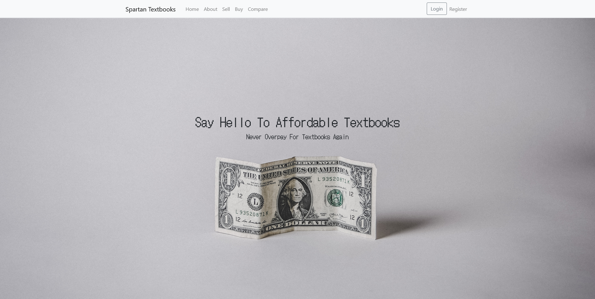
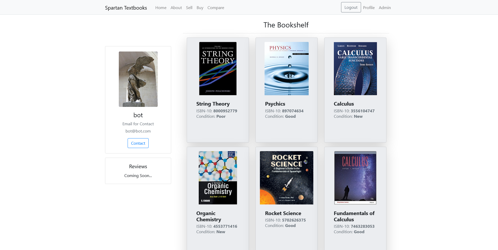

****currently being written and updated****
# University Textbook Marketplace

This project is an a responsive web app to help address high textbook prices by making sales directly student to student and centralized on a university campus, it was built in the spand of three months in a team of six people and a live version can be seen [here](http://uncg-textbook-marketplace.herokuapp.com/) 

## Objective & Implementation

- **The main objective of this project is to help make textbook prices lower, by making the sales student to student only**
- 

  
  <b>home page that users are greeted with on Spartan Textbooks</b> 

## Stack
- Python(Flask) - Backend   
- HTML/CSS - Frontend
- Boostrap - Frontend
- SQLite - Database
- SQLAlchemy - object relational mapper between the database and Flask

## Features

- Secure user accounts with hashed passwords 

- Browse textbooks for sale

- Textbook filtering by title and condition 

- Admin dashboard to edit and delete current user and post information if needed

- Post textbooks for sale

- User profiles 
- 

  
  <b>user profile example with all books posts by that specific user</b> 

## Documentation

## About
This project was made in a team of six over the course of three months in a senior capstone course using the agile method of development. 

## Authors
- [@cloud0x9](https://github.com/cloud0x9) ......
